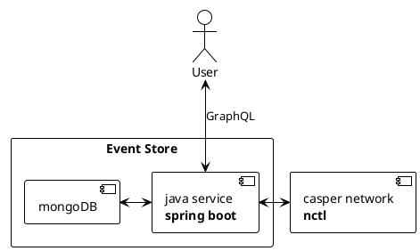
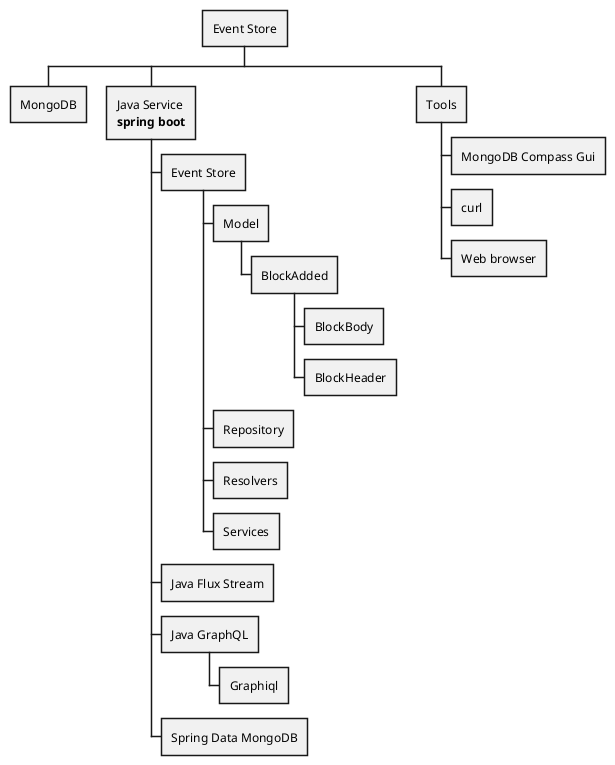
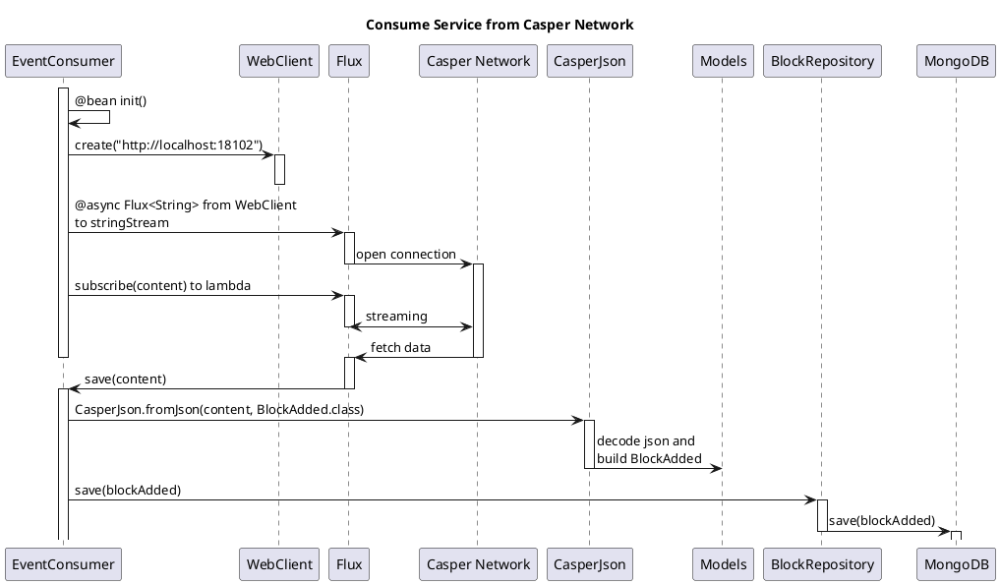
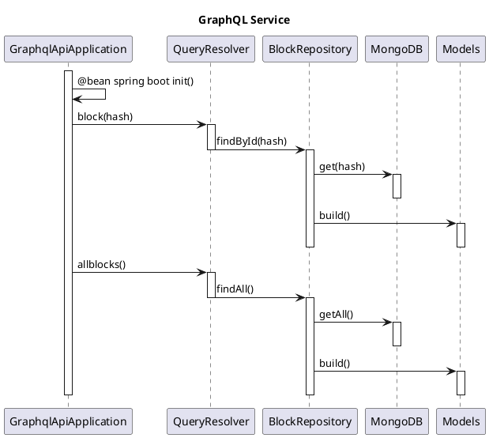

## Components

```plantuml
@startuml
'!theme sandstone
!theme plain
component casper as "casper network\n**nctl**"
rectangle "Event Store" {
component back as "java service\n**spring boot**"
component db as "mongoDB"
}
actor User
back <-> casper
back <-l-> db
User <--> back : "GraphQL"
@enduml
```

## Architecture

```plantuml
@startwbs
* Event Store
** MongoDB
** Java Service\n**spring boot**
*** Event Store
**** Model
***** BlockAdded
****** BlockBody
****** BlockHeader
**** Repository
**** Resolvers
**** Services
*** Java Flux Stream
*** Java GraphQL
**** Graphiql
*** Spring Data MongoDB
** Tools
*** MongoDB Compass Gui
*** curl
*** Web browser

@endwbs
```

```plantuml
@startuml
title Consume Service from Casper Network

activate EventConsumer
EventConsumer -> EventConsumer : @bean init()
EventConsumer -> WebClient : create("http://localhost:18102")
activate WebClient
deactivate WebClient
EventConsumer -> Flux : @async Flux<String> from WebClient\nto stringStream
activate Flux
Flux -> "Casper Network" : open connection
deactivate Flux
activate "Casper Network"
EventConsumer -> Flux : subscribe(content) to lambda
activate Flux
Flux <-> "Casper Network" : streaming
deactivate Flux

Flux <- "Casper Network" : fetch data
deactivate "Casper Network"
deactivate EventConsumer
activate Flux
Flux -> EventConsumer : save(content)
deactivate Flux
activate EventConsumer
EventConsumer -> CasperJson : CasperJson.fromJson(content, BlockAdded.class)
activate CasperJson
CasperJson -> Models : decode json and\nbuild BlockAdded
deactivate CasperJson
EventConsumer -> BlockRepository : save(blockAdded)
activate BlockRepository
BlockRepository -> MongoDB : save(blockAdded)
deactivate BlockRepository
activate MongoDB
deactivate MongoDB

@enduml
```

```plantuml
@startuml
title GraphQL Service

activate GraphqlApiApplication
GraphqlApiApplication -> GraphqlApiApplication : @bean spring boot init()
GraphqlApiApplication -> QueryResolver : block(hash)
activate QueryResolver
QueryResolver -> BlockRepository : findById(hash)
deactivate QueryResolver
activate BlockRepository
BlockRepository -> MongoDB : get(hash)
activate MongoDB
deactivate MongoDB
BlockRepository -> Models : build()
activate Models
deactivate BlockRepository
deactivate Models
GraphqlApiApplication -> QueryResolver : allblocks()
activate QueryResolver
QueryResolver -> BlockRepository : findAll()
deactivate QueryResolver
activate BlockRepository
BlockRepository -> MongoDB : getAll()
activate MongoDB
deactivate MongoDB
BlockRepository -> Models : build()
activate Models
deactivate BlockRepository
deactivate Models
deactivate GraphqlApiApplication
@enduml
```

