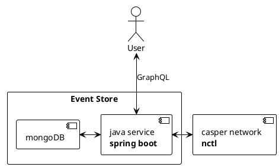
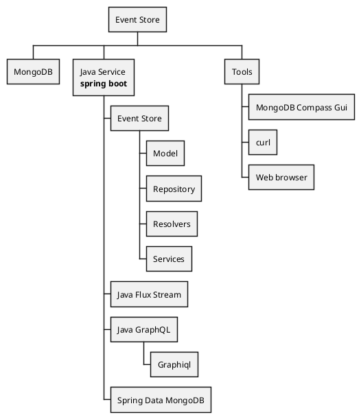

## Components

```plantuml
@startuml
'!theme sandstone
!theme plain
component casper as "casper network\n**nctl**"
rectangle "Event Store" {
component back as "java service\n**spring boot**"
component db as "mongoDB"
}
actor User
back <-> casper
back <-l-> db
User <--> back : "GraphQL"
@enduml
```

## Architecture

```plantuml
@startwbs
* Event Store
** MongoDB
** Java Service\n**spring boot**
*** Event Store
**** Model
**** Repository
**** Resolvers
**** Services
*** Java Flux Stream
*** Java GraphQL
**** Graphiql
*** Spring Data MongoDB
** Tools
*** MongoDB Compass Gui
*** curl
*** Web browser

@endwbs
```
